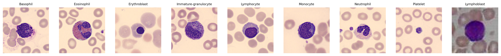
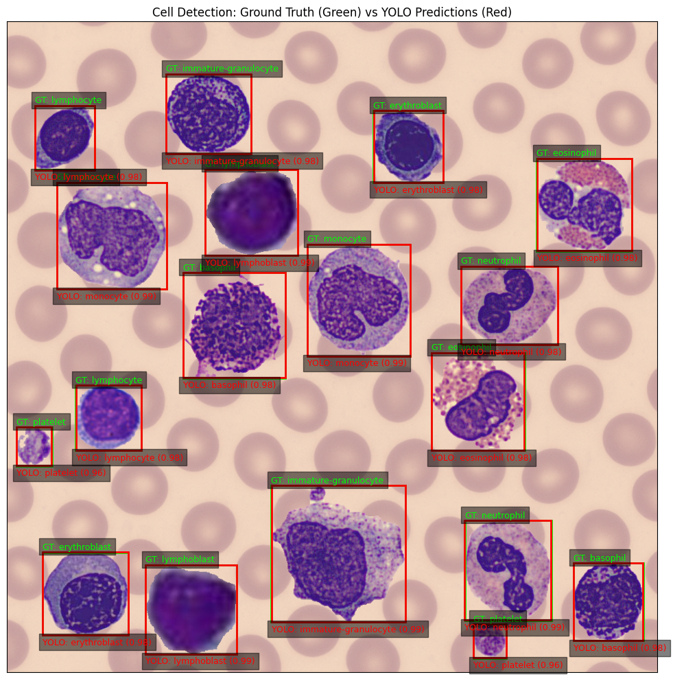

# Synthetic Dataset Generation Pipeline for Blood Cell Detection

## Overview

This repository documents the **synthetic image generation pipeline** developed as part of a computer vision R&D project. The primary goal of this work is to **generate realistic, annotated microscopy images** by composing segmented blood cell instances onto clean backgrounds, enabling effective training and evaluation of object detection models.

⚠️ **Scope note:** This repository includes **work completed up to April 2025**. From **Week 10 onwards**, the focus shifts specifically to **cell segmentation and synthetic image composition**.

---

## Project Focus

This repository focuses on:

- Segmentation of individual blood cells from microscopy images
- Synthetic image creation via controlled composition of segmented instances
- Automatic generation of bounding-box annotations in YOLO format
- Visual validation using object detection model outputs

---

## Pipeline Summary

### 1. Cell Segmentation (Week 10 onwards)

Individual blood cells are segmented from microscopy images to create reusable foreground instances. The pipeline extracts clean cell instances across multiple classes for downstream composition.

  
*Figure 1: Representative examples of different blood cell classes extracted from the base dataset. Each column shows instances of a specific cell type used as building blocks for synthetic image generation.*

The segmentation pipeline uses **classical image processing techniques**, including:

- Color space transformations (HSV / LAB)
- Contrast enhancement using **CLAHE** (Contrast Limited Adaptive Histogram Equalization)
- Thresholding methods such as **Otsu's thresholding**
- Morphological operations (opening, closing, erosion, dilation)
- Watershed-based separation for touching cells

### 2. Synthetic Image Composition

Segmented cell instances are randomly placed onto clean backgrounds to generate synthetic microscopy images. The composition process:

- Randomly samples cells from different classes
- Places them with controlled spacing to avoid excessive overlap
- Generates corresponding YOLO-format bounding box annotations
- Exports both the composite image and annotation file

### 3. Detection Validation

Generated synthetic images are validated using a trained YOLO object detection model to verify the quality and realism of the composites.

  
*Figure 2: Validation of synthetic composite images. Ground-truth bounding boxes (green) are automatically generated during composition, while YOLO model predictions (red) demonstrate successful detection of synthesized cells.*

---

## Documentation & Repository Structure

### Main Documentation

- **[Detailed Project Report](22b2505_Report_DH307.pdf)** – Complete methodology, experiments, and results

### Week-wise Folders

Work is organized chronologically into week-specific folders:

- **`Week1/` – `Week9-10/`**: Foundational computer vision tasks and preliminary experiments
- **`Week10 onwards/`**: Cell segmentation pipeline and synthetic dataset generation
- **`Week11/`, `Week12/`**: Refinements, validation, and final integration

Each folder contains notebooks, scripts, and visual outputs relevant to that phase of development.

